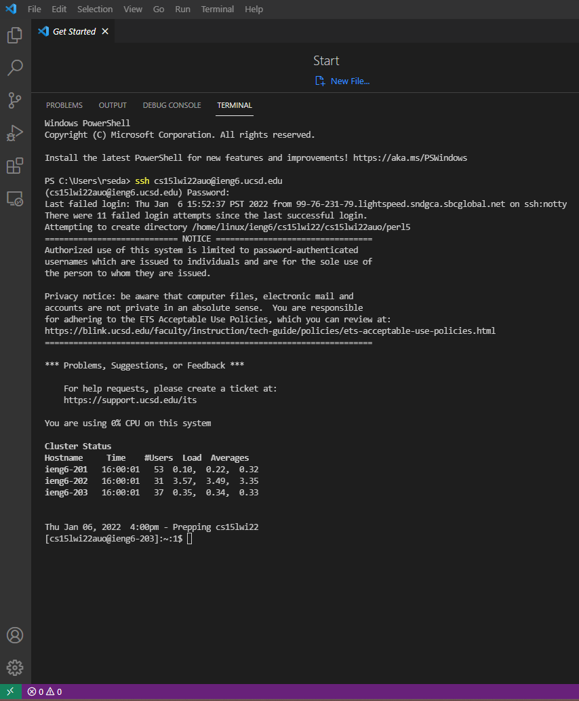
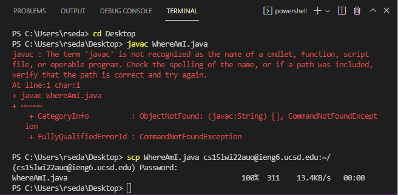

# Week 2 lab report

Above is the image if opening my VSCode application as I have already installed it for using during CSE11. Therefore, I didn't install VSCOde for this class, but when I did, all I had to do was do to the VSCode website and download to install.

Here, I am remotely connecting. At first I did have trouble due to the nature of VSCode and UCSD's passwords system not updating. Eventually though, the thing that helped was waiting, as resetting the password of the UCSD account can take up to 20 minutes to update, of which after I did, worked very efficiently. 

At the time of doing this project I actually did not get the chance to capture photos of all the steps  I needed to do, so I unfortunately do not have a phot trying out the commands. However, I know that all the commands I need can be found under help, or going back to the Lab 1 part 4 section.

In the next section, I got into moving files with scp. However, another major problem I bad been going to was that my java and jdk were not set up properly, and therefore could not run -javac or -java as instructed to when I needed to as extra step I had to do (I am on Windows) However, this phot is what the TA told me to turn in as it would meet the criteria for the section.
